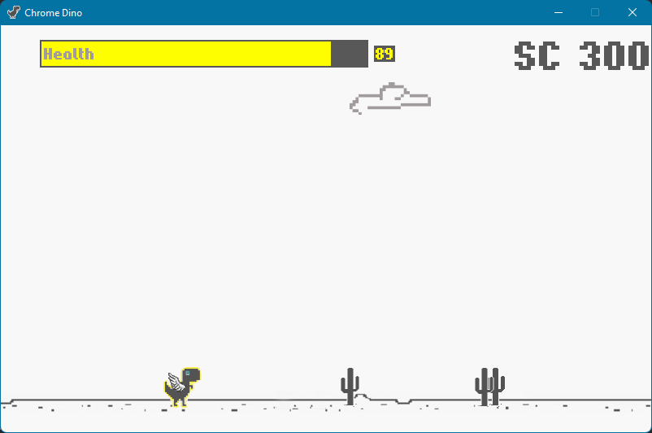

# Chrome Dino

This is a clone of the Chrome Dino (a. k. a. Dino Run, T-Rex Game) browser game with additional features on Python using [pygame](https://www.pygame.org/)

The features are: Main menu, Scoreboard menu, Health bar, Bonuses (such as health bonus, time slow bonus and godmode bonus) and Ability to pause the game

- In the main menu you can enter your name, start the game, quit the game and go to the scoreboard menu
- The health bonus gives you 20 health points (sometimes 40, it's a bug) when you pick it up
- The time slow bonus slows the time (what else hehe c:)
- The godmode bonus gives you ability not to take damage for ~3 seconds

---

## Setup

1. Install Python 3.x (I used 3.10) from [python.org](https://www.python.org/download/releases/)

1. Install modules pygame and pygame-gui:

	```
	pip install *module-name*
	```

1. Start game from command prompt in game directory using this command:

	```
	python main.py (or python3 main.py)
	```

1. Use <kbd>Space</kbd> for jump, <kbd>&darr;</kbd> for duck and <kbd>Esc</kbd> for pause. When the game is over you can press <kbd>R</kbd> to quickly restart the game. You can also see some debug info using <kbd>F3</kbd>

---

## Screenshots and demo

### Screenshots

- Main menu


- Empty scoreboard menu


- Start of the game


- Some gameplay screenshots




- Game over


- Scoreboard menu with records


---

### Demo

